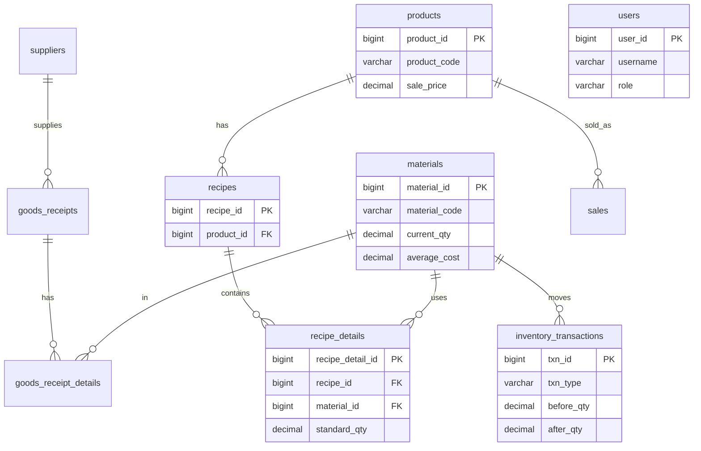

# Cafe Inventory Management System

Hệ thống quản lý kho nguyên vật liệu cho quán cafe: kiểm tra tồn kho, khai báo **công thức / định mức (BOM)** cho từng loại nước, nhập bán hàng và **tự động tính lượng nguyên vật liệu đã dùng + tự động trừ kho**.

Xây dựng theo kiến trúc **SQL First** với **Java 21 + Spring Boot 3 (REST API) + MySQL 8** và frontend **ReactJS + Ant Design** (SPA admin chuyên nghiệp).

---

## 1. Tính năng (bản Core hiện tại)

| Module | Mô tả |
|--------|------|
| Đăng nhập | **JWT** (stateless) + BCrypt. RBAC: ADMIN / MANAGER / STAFF / VIEWER. UI React lưu token, tự gắn `Authorization: Bearer` |
| Nguyên vật liệu | CRUD, đơn vị tính, tồn kho, định mức min/max, giá vốn trung bình |
| Sản phẩm | CRUD các loại nước bán ra |
| Công thức (BOM) | Định nghĩa định mức nguyên liệu cho mỗi sản phẩm + **tự tính giá vốn** |
| Nhập kho | Phiếu nhập (GR2026xxxxxx), nhập tay hoặc **import Excel/CSV** → tăng tồn + **giá vốn bình quân gia quyền** |
| Bán hàng | Nhập tay hoặc **import Excel/CSV** → nổ công thức → **tự trừ kho** |
| Cảnh báo đăng nhập | Popup cảnh báo nguyên vật liệu dưới định mức ngay khi vừa login |
| Dự báo AI | Dự báo ngày hết hàng + đề xuất lượng nhập (engine thống kê) + khuyến nghị **Google Gemini** (tuỳ chọn, free) |
| Sổ kho | Mọi biến động ghi vào `inventory_transactions` (before/after qty) |
| Dashboard | KPI (sản phẩm, vật liệu, giá trị tồn, doanh thu hôm nay, sắp hết hàng) + biểu đồ top bán chạy (Recharts) |
| Sổ kho / Cảnh báo | Lịch sử biến động tồn + danh sách vật liệu dưới định mức |
| Giao diện | **ReactJS + Ant Design**: sidebar menu đầy đủ, bảng/biểu mẫu chuyên nghiệp, responsive |
| API docs | Swagger UI tại `/swagger-ui.html` |

> Các module mở rộng theo spec (Stock Adjustment, Stock Count, Báo cáo đầy đủ, Stored Procedures, test coverage 80%) đã có nền tảng (bảng/transaction type) và sẽ bổ sung ở giai đoạn sau.

---

## 2. Kiến trúc SQL First

```
Database (MySQL 8)
   └─ Flyway migration  src/main/resources/db/migration
        V1__schema.sql      -- bảng
        V2__index.sql       -- index
        V3__views.sql       -- view báo cáo
        V5__seed_data.sql   -- dữ liệu mẫu (materials/products/recipes)
   └─ Entity → Repository → Service → Controller → UI (Thymeleaf)
```

Hibernate chạy ở chế độ `ddl-auto: none` — **toàn bộ schema do Flyway tạo**, entity chỉ ánh xạ.

### ERD



---

## 3. Logic tự động trừ kho (cốt lõi)

Ví dụ công thức **Coffee Milk**: Coffee 20g, Condensed Milk 30ml, Ice 150g, Cup 1.
Bán **100 ly** → hệ thống tính:

```
Coffee 20×100 = 2000g   |  Milk 30×100 = 3000ml
Ice 150×100 = 15000g    |  Cup 1×100   = 100
```

→ trừ thẳng vào `materials.current_qty` và ghi `inventory_transactions` (type = `SALE_CONSUMPTION`).
Mã nguồn: [`SalesService`](src/main/java/com/cafe/inventory/service/SalesService.java) + [`InventoryService`](src/main/java/com/cafe/inventory/service/InventoryService.java).

---

## 4. Chạy bằng Docker (không cần cài Java/MySQL)

```bash
cp .env.example .env      # tuỳ chỉnh mật khẩu nếu muốn
docker compose up -d
```

- Web: http://localhost:8080  → đăng nhập `admin / admin123`
- Swagger: http://localhost:8080/swagger-ui.html
- MySQL: cổng `3307` trên host.

Flyway tự tạo schema + seed; `DataInitializer` tự tạo user admin (mật khẩu băm BCrypt).

---

## 5. REST API (JWT)

```bash
# 1) Lấy token
curl -X POST http://localhost:8080/api/auth/login \
  -H "Content-Type: application/json" \
  -d '{"username":"admin","password":"admin123"}'

# 2) Gọi API kèm token
curl http://localhost:8080/api/materials -H "Authorization: Bearer <TOKEN>"

# 3) Ghi nhận bán hàng (tự trừ kho)
curl -X POST http://localhost:8080/api/sales \
  -H "Authorization: Bearer <TOKEN>" -H "Content-Type: application/json" \
  -d '{"saleDate":"2026-06-23","lines":[{"productCode":"CF002","quantity":100}]}'
```

Các endpoint: `/api/auth`, `/api/materials`, `/api/products`, `/api/recipes`, `/api/goods-receipts`, `/api/sales` (+ `/import`), `/api/inventory`, `/api/dashboard`.

---

## 6. Deploy lên web free

Xem hướng dẫn chi tiết tại **[DEPLOYMENT.md](DEPLOYMENT.md)** (Render + MySQL free).

---

## 7. Cấu trúc thư mục

```
src/main/java/com/cafe/inventory   ← Backend (Spring Boot REST API)
  ├─ config        DataInitializer, OpenApiConfig
  ├─ controller    api/ (REST)  +  web/SpaForwardController (phục vụ SPA)
  ├─ dto           record DTOs
  ├─ entity        JPA entities + enums
  ├─ exception     custom + global handler
  ├─ repository    Spring Data JPA
  ├─ security      JWT, SecurityConfig, UserDetailsService
  └─ service       business logic
src/main/resources
  ├─ db/migration  Flyway SQL
  └─ static        ← bản build React (sinh tự động khi build Docker)

frontend/                          ← Frontend (ReactJS + Ant Design + Vite)
  ├─ src/pages       Dashboard, Materials, Products, Recipes, GoodsReceipt, Sales, Inventory, LowStock
  ├─ src/components  AppLayout (sidebar + header)
  ├─ src/context     AuthContext (JWT)
  └─ src/api         axios client
```

### Chạy frontend ở chế độ dev (tuỳ chọn, cần Node 20)

```bash
# Terminal 1: backend
mvn spring-boot:run            # http://localhost:8080

# Terminal 2: frontend (Vite proxy /api -> :8080)
cd frontend
npm install
npm run dev                    # http://localhost:5173
```

Khi deploy bằng Docker, frontend được **build và nhúng vào jar tự động** — không cần Node trên máy.

## 8. Tài khoản mặc định

| User | Pass | Role |
|------|------|------|
| admin | admin123 | ADMIN |

Đổi qua biến môi trường `ADMIN_USERNAME` / `ADMIN_PASSWORD` trước lần khởi động đầu tiên.
